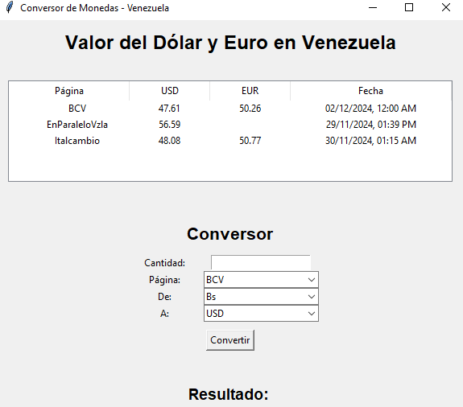

# Convertidor-de-Moneda
Programa para obtener información en tiempo real sobre el valor del dólar y euro en Venezuela usando la 
API pyDolarVenezuela. 
La aplicación obtiene los datos de tres entidades de seguimiento del dólar y/o euro: BCV, EnParaleloVzla e Italcambio. 
Muestra su nombre, cambio y fecha de la última actualización.
Además, permite la conversión entre bolívares y estas monedas extranjeras, seleccionando la tasa de cambio de la 
página o entidad.

## Software usado
- Python 3.11
- Librería requests para manejar la API 
- Interfaz gráfica tkinter
- API: https://github.com/fcoagz/api-pydolarvenezuela
